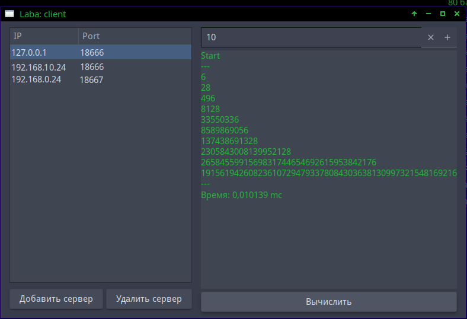

# Even Perfect Number

> Совершенное число — натуральное число, равное сумме всех своих собственных делителей 

Поиск чётных совершенных чисел при помощи кластеров. Приложения разработаны и протестированы на операционных системах GNU/Linux. 

Чётные совершенные числа можно вычислить по формуле `2^(p-1) * (2^p -1)`, где `2^p - 1` являться простым. 

`2^p - 1` — если число простое, то это *число Мерсенна*. Его можно проверить на простоту с помощи *тест Люка-Лемера*. 

Приложение разделено на две части, клиент и сервер:

* **Сервер**: проводит все вычисления по нахождению чётных совершенных чисел.
* **Клиент**: создаёт задачи для серверов и принимает результаты вычислений.

Сервер не обладает графической оболочкой и выводит логи о своей работе в окно терминала. При запуске сервер создаёт tcp сокет, по которому получает данные.

Клиент представляет собой графическое приложение c использованием библиотеки GTK.



Таблица в левом углу содержит список серверов кластера. Для подключения нового кластера необходимо нажать на кнопку «Добавить сервер» под таблицей, после чего вписать в форму ipv4 адрес и порт сервера.

В верхнем правом углу находиться форма, в которую необходимо написать положительное целое число. Число указанное в это форме определяет количество чётных совершенных чисел, которые будет искать программа. По умолчанию эта форма содержит число 5.

Под формой с числом находиться тестовая форма, куда программа выводит результат.
В правом нижнем углу расположена кнопка «Вычислить», после чего программа начнёт свою работу по указанным данных.

Для сборки приложения необходимо перейти в директорию сервера/клиента и выполните команды:

```
cmake ./
make
```
